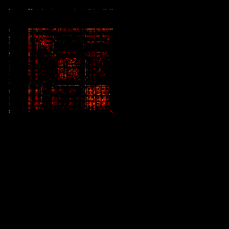
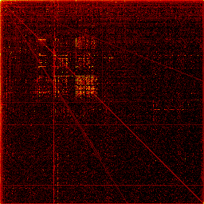
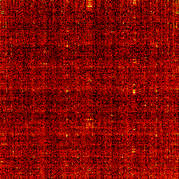

# filetype-visualizer
Visualize file type by byte order patterns

This essentially reads a file byte by byte and creates a 2D histogram plot to show
which byte values follow which byte values how often. The inspiration for this
project stems from a TED talk which I cannot seem to find, in which the talker
demonstrated how different types of files -- JPEGs, source code, binary
executables -- produced radically different patterns when visalized this way.
The talk was essentially about hacking into people's phones, for example to
defuse home-built bombs, if I recall correctly. I would be thankful if someone
could point me to the talk in question.

# Example
Using a _log+1_ normalizer, we visualize the byte to byte transitions of all
.cpp files from this project:

The `main` binary file:

An arbitrary PNG file:

